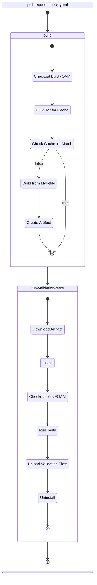
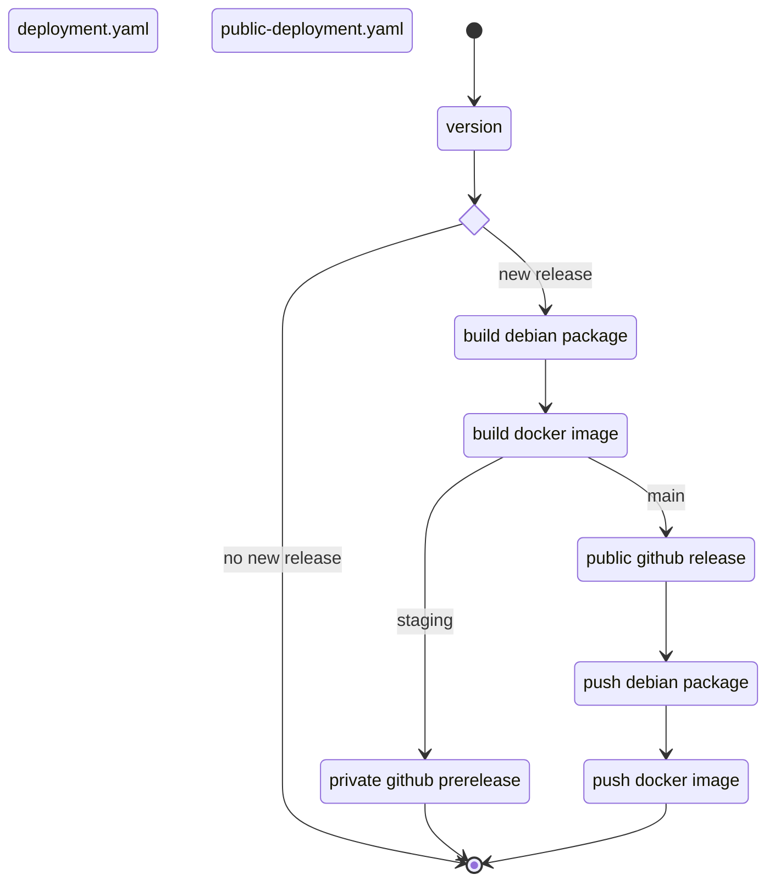

# Actions README

## On pull request build/merge/sync

```mermaid
  stateDiagram-v2
  %% Steps
  cbf: Checkout blastFOAM
  tar: Build Tar for Cache
  cc: Check Cache for Match
  make: Build from Makefile
  art: Create Artifact
  da: Download Artifact
  inst: Install
  cbf2: Checkout blastFOAM
  run: Run Tests
  pl: Upload Validation Plots
  uninst: Uninstall

  %% Jobs
  val: run-validation-tests
  state build {
    [*] --> cbf
    cbf --> tar
    tar --> cc

    cc --> make: false
    make --> art
    art --> [*]

    cc --> [*]: true
  }
  state val {
    [*] --> da
    da --> inst
    inst --> cbf2
    cbf2 --> run
    run --> pl
    pl --> uninst
    uninst --> [*]

  }

  %% Workflows
  state "pull-request-check.yaml" as prc
  state prc {
  [*] --> build
  build --> val
  val --> [*]
  }
```

## Continuous Distribution

_Run on push to staging, master, dev_

```mermaid
  stateDiagram-v2

  state "deployment.yaml" as dep
  state "public-deployment.yaml" as pdep
  state "build debian package" as deb
  state "build docker image" as doc
  state "private github prerelease" as pre
  state "public github release" as pub
  state "push docker image" as docPush
  state "push debian package" as debPush
  state new_release <<choice>>

  [*] --> version
  version --> new_release
  new_release --> deb: new release
  new_release --> [*]: no new release
  deb --> doc
  doc --> pre: staging
  pre --> [*]

  doc --> pub: main
  pub --> debPush
  debPush --> docPush
  docPush --> [*]


```
