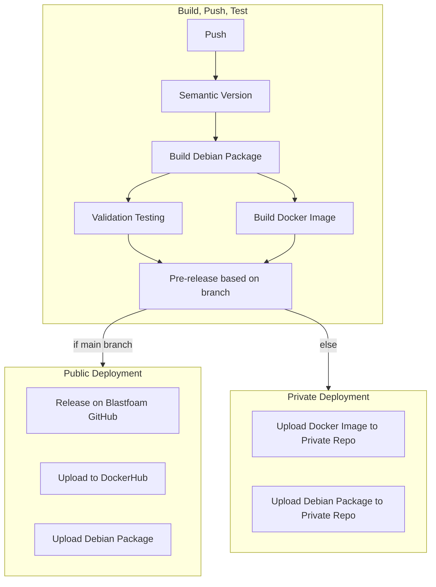
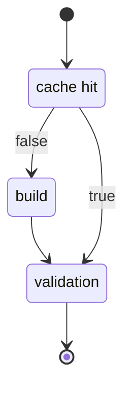
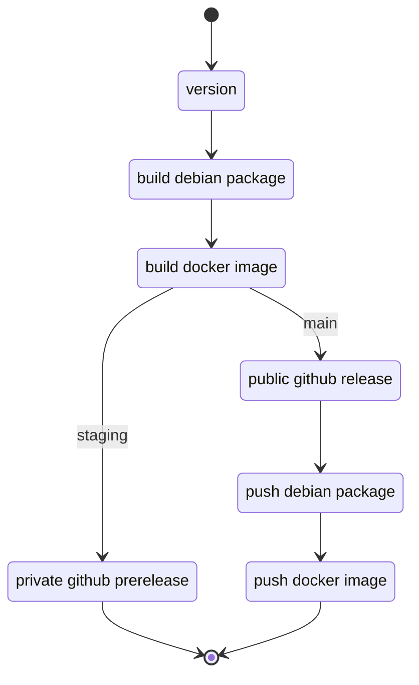

# Actions README

Note: Each step requires the previous step(s) to complete (unless otherwise noted).
_This is deprecated and replaced with the below_

## On pull request build/merge/sync

## Continuous Distribution

_Run on push to staging, master, dev_

