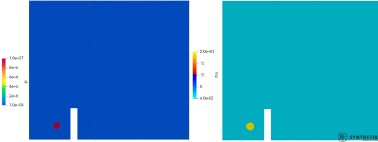
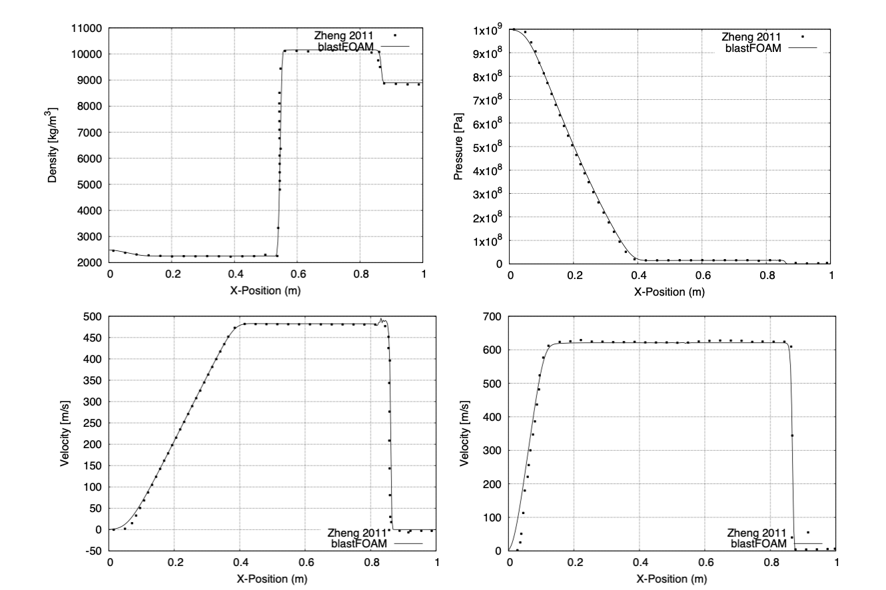

<!--- python3 -m readme2tex --nocdn --pngtrick --htmlize --output README.md INPUT.md && open README.md.html -->


<p align="center">
  
</p>


# blastFoam

blastFoam is a solver for multi-phase compressible flow with application to high-explosive detonation, explosive safety and airblast, as well as general compressible flows. blastFoam is developed by [Synthetik Applied Technologies](https://www.synthetik-technologies.com).


## Disclaimer

This offering is not approved or endorsed by OpenCFD Limited, producer and distributor of the OpenFOAM software via www.openfoam.com, and owner of the OPENFOAM  and OpenCFD trade marks.


## What is blastFoam?

blastFoam is a solver for multi-component compressible flow with application to high-explosive detonation, explosive safety and airblast, as well as general high-speed compressible flows. The blastFoam solver uses OpenFOAM technology, and is in no way approved or endorsed by OpenCFD Limited, producer and distributor of the OpenFOAM software via www.openfoam.com, and owner of the OPENFOAM  and OpenCFD trade marks (see Disclaimer above).


## How to use blastFoam

Several validation and tutorial cases are included in the repository, and are documented in the [blastFoam User Guide](blastFoam_User_Guide.pdf).


## Installation

1. Install OpenFOAM from [source](https://github.com/OpenFOAM/OpenFOAM-7) or via binary/package installation from [here](https://openfoam.org/version/7/) (blastFoam works with OF version 7).

2. Create the OpenFOAM directory
```bash
mkdir -p $HOME/OpenFOAM
```

3. Go to the $HOME/OpenFOAM directory
```bash
cd $HOME/OpenFOAM
```

4. Clone the blastFoam repository
```bash
git clone https://github.com/synthetik-technologies/blastfoam
```

5. Go to the blastfoam directory
```bash
cd $HOME/OpenFOAM/blastfoam
```

6. Append the etc/bashrc to your .bashrc file
```bash
echo "source $HOME/OpenFOAM/blastfoam/etc/bashrc" >> $HOME/.bashrc
```

7. Load and set the bash environment to compile blastFoam
```bash
source $HOME/.bashrc
```

8. Compile blastFoam (for parallel use "-j")
```bash
./Allwmake
```


9. Test your installation by running the tutorial and validation cases


## Questions and Availability
If you find any bugs, please let us know in the issues section of the repository. If you want to get in touch: info@synthetik-technologies.com

blastFoam is also available on the Texas Advanced Computing Center https://www.tacc.utexas.edu (TACC)


## Citation
If you use this code for your work or research, please use this citation:

```
blastFoam: An OpenFOAM Solver for Compressible Multi-Fluid Flow with Application to High-Explosive Detonation. Synthetik Applied Technologies, LLC., 2020.
```
BiBTex:
```
@software{blastfoam,
	title = {{blastFoam}: A Solver for Compressible Multi-Fluid Flow with Application to High-Explosive Detonation},
	url = {https://github.com/synthetik-technologies/blastfoam},
	publisher = {Synthetik Applied Technologies, {LLC}.},
	date = {2020-04-13}
}
```

## User Guide
To cite the [blastFoam User Guide](blastFoam_User_Guide.pdf).:
```
J. Heylmun, P. Vonk, and T. Brewer, “blastFoam User Guide.” Synthetik Applied Technologies, LLC., 13-Apr-2020.
```
BiBTex:
```
@misc{heylmun_blastfoamguide_2020,
	title = {{blastFoam version 3.0} {User} {Guide} },
	url = {https://github.com/synthetik-technologies/blastfoam},
	language = {English},
	publisher = {Synthetik Applied Technologies, LLC.},
	author = {Heylmun, Jeffrey and Vonk, Peter and Brewer, Timothy},
	month = oct,
	year = {2020}
}
```


## blastFoam Publications:

### Journals/Conferences

1. T. Brewer, J. Heylmun, and P. Vonk, “Employment of the Open-source Airblast Solver blastFoam to Support the Super Heavy Improvised Explosive Loading Demonstration (SHIELD) Test Program,” presented at the ISIEMS, USA, 2019.
1. D. Stephens, P. Vonk, and T. Brewer, “Validation of Open-source Airblast Solver (blastFoam) in an Urban Environment,” presented at the MABS 25, Hague, Netherlands, 2018.
1. P. Vonk, “A New OpenFOAM Solver for Compressible Multi-Fluid Flow with Application to High-Explosive Detonation,” presented at the OpenFOAM Users Conference, Cologne, Germany, 2016.
1. P. Vonk, T. Brewer, “A New OpenFOAM Solver for Compressible Multi-Fluid Flow with Application to High-Explosive Detonation and Extended Validation,” presented at the OpenFOAM Users Conference, USA, 2016.


## Features

blastFoam currently supports the following features:

- An arbitrary number of phases/EOS's
- Temperature-based and internal energy-based (Mie-Gruneisen form) equation of states
- Detonation models (Activation and afterburn)
- Multiple example and tutorial cases
- Automatic mesh refinement (AMR)
- Blast specific function object for post-processing
- High-order (1st, 2nd, 3rd and 4th order in time; 2nd and 3rd order spatial)
- HLLC, AUSM+, Kurganov, Tadmor flux schemes
- Parallel (MPI)
- Compatible with all of OpenFOAM's standard mesh generation, pre- and post-processing utilities


## Equations of State

blastFoam includes the following equations of state:

- Ideal gas
- Stiffened gas
- Tait
- Van der Waals
- Landau, Stanyukovich, Zeldovich, and Kompaneets (LSZK)
- Jones Wilkens Lee (JWL)
- Cochran-Chan
- Doan-Nickel
- Jones Wilkens Lee C-Form (JWLC)
- Becker Kistiakowsky Wilson (BKW)
- Benedict Webb Rubin (BWR)
- Murnaghan
- Birch Murnaghan (2nd and 3rd order)
- Tabulated


## Activation models

blastFoam includes the following activation models

- None (instantaneous reaction)
- Multi-point linear activation
- Pressure-based
- Arrhenius rate
- Constant rate


## Afterburn models

blastFoam includes the following afterburn models

- None
- Constant
- Linear
- Miller


## Verification and Validation

blastFoam has been validated against known solutions to standard gas dynamics problems, and against data from physical tests. Validation cases are included with example/tutorial cases as part of the solver source code.


### Validation/Example: Internal Detonation

Reference:
```
Joachim, Charles E., Gordon W. McMahon, Christo V. Lunderman, and Sharon B. Garner. 1999. “Airblast Effects Research: Small-Scale Experiments and Calculations.” DTIC Document.
```


Validation against experimental and simulated (CTH) data as reported in Joachim et. al.; see the paper for an explanation of scaling.


### Validation/Example: Blast Loads Behind Vertical Walls

Reference:
```
M. E. Beyer, “Blast Loads Behind Vertical Walls,” Naval Civil Engineering Laboratory, Port Hueneme, CA, USA, AD-A181 274, 1986.
```




### Validation/Example: Multi-Component Flow Verification

Reference:
```
Zheng, H. W., C. Shu, Y. T. Chew, and N. Qin. “A Solution Adaptive Simulation of Compressible Multi-Fluid Flows with General Equation of State.” International Journal for Numerical Methods in Fluids 67, no. 5 (2011): 616–637.
```

Verification and validation results as compared to those published by Zheng et. al.; HLLC flux shown.





