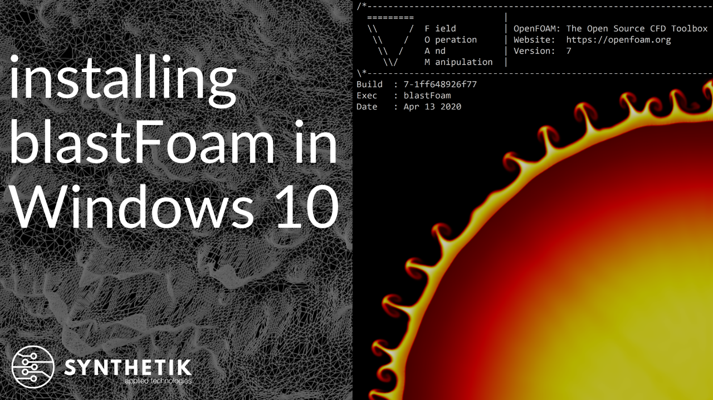

<!--- python3 -m readme2tex --nocdn --pngtrick --htmlize --output README.md INPUT.md && open README.md.html -->


<p align="center">
  
</p>


# blastFoam Version 3.5

blastFoam is a solver for multi-phase compressible flow with application to high-explosive detonation, explosive safety and airblast, as well as general compressible flows. blastFoam is developed by [Synthetik Applied Technologies](https://www.synthetik-technologies.com). This offering is not approved or endorsed by OpenCFD Limited, producer and distributor of the OpenFOAM software via www.openfoam.com, and owner of the OPENFOAM  and OpenCFD trade marks.


## How to use blastFoam

Several validation and tutorial cases are included in the repository, and are documented in the [blastFoam User Guide](blastFoam_User_Guide.pdf).


### blastFoam workshop | Date: May 13, 2020 | Location: Virtual/Online | Cost: Free
#### The May 13th blastFoam workshop is Sold Out! 

Thank you to everyone who attended! 

The workshop tutorial case and modifications have been added to the repository: [tutorials/blastFoam/building3DWorkshop](tutorials/blastFoam/building3DWorkshop). 

A recording of the workshop is also available on YouTube: [blastFoam May 13, 2020 Workshop on YouTube](https://www.youtube.com/watch?v=0YYrkwNWM6U). 

The slides from the workshop have been added to the repository: [blastFoam May Workshop Slides](media/Synthetik-Applied-Technologies-blastFoam-Workshop-May-Final-20200513.pdf)

### blastFoam workshop | Date: July 14, 2020 | Location: Virtual/Online | Cost: Free
#### The July 13th workshop is Sold Out!


## Installation

Detailed instructions on how to install and use blastFoam are found in the [blastFoam User Guide](blastFoam_User_Guide.pdf). Installation is simple and requires only OpenFOAM-7 and (optionally) gnuplot be installed. Basic installation steps are as follows:


### How to install OpenFOAM for Windows 10
An installation video for Windows 10 is available on our YouTube channel: https://youtu.be/vfd610LadSU

<p align="center">
  
</p>


### How to Install OpenFOAM for macOS
Compiling OpenFOAM on macOS is relatively straightforward. This [guide and repository](https://github.com/mrklein/openfoam-os-x/wiki/OpenFOAM(R)-git-version-&-Homebrew) provides step-by-step instructions as well as the necessary patch to compile OpenFOAM on macOS. The main steps from the guide are reproduced below. 

1. Install the Homebrew package manager, if not already installed:
```bash
/bin/bash -c "$(curl -fsSL https://raw.githubusercontent.com/Homebrew/install/master/install.sh)"
```

2. Install OpenFOAM dependencies: 
```bash
brew install open-mpi
brew install boost
brew install cgal
brew install metis
brew install https://raw.githubusercontent.com/mrklein/openfoam-os-x/master/formulae/scotch.rb
brew install https://raw.githubusercontent.com/mrklein/openfoam-os-x/master/formulae/parmgridgen.rb
```


3. Create a volume with a case sensitive file system:
```bash
cd $HOME
hdiutil create -size 8.3g -type SPARSEBUNDLE -fs HFSX -volname OpenFOAM -fsargs -s OpenFOAM.sparsebundle
mkdir -p OpenFOAM
hdiutil attach -mountpoint $HOME/OpenFOAM OpenFOAM.sparsebundle
```

4. Clone the OpenFOAM-7 repository and get and apply the patch:
```bash
cd $HOME/OpenFOAM
git clone https://github.com/OpenFOAM/OpenFOAM-7.git
cd OpenFOAM-7
curl -L https://raw.githubusercontent.com/mrklein/openfoam-os-x/master/OpenFOAM-7-83cd285f0.patch > OpenFOAM-7-83cd285f0.patch
git checkout -b local-install 83cd285f0
git apply OpenFOAM-7-83cd285f0.patch
```

5. Set up the OpenFOAM config options for compilation:
```bash
mkdir -p $HOME/.OpenFOAM
echo 'WM_COMPILER=Clang' > $HOME/.OpenFOAM/prefs.sh
echo 'WM_COMPILE_OPTION=Opt' >> $HOME/.OpenFOAM/prefs.sh
echo 'WM_MPLIB=SYSTEMOPENMPI' >> $HOME/.OpenFOAM/prefs.sh
echo 'export WM_NCOMPPROCS=$(sysctl -n hw.ncpu)' >> $HOME/.OpenFOAM/prefs.sh
echo 'WM_LABEL_SIZE=32' >> $HOME/.OpenFOAM/prefs.sh
```


6. Compile OpenFOAM
```bash
source etc/bashrc
echo "source $HOME/OpenFOAM/OpenFOAM-7/etc/bashrc" >> ~/.bashrc
echo "source $HOME/OpenFOAM/OpenFOAM-7/etc/bashrc" >> ~/.zshrc
[ "$(ulimit -n)" -lt "4096" ] && ulimit -n 4096
./Allwmake > log.Allwmake 2>&1
```


### How to install blastFoam 

1. Install OpenFOAM-7 (if not already installed, see above)

See https://openfoam.org/version/7 for OpenFOAM installation instructions.

2. Create the OpenFOAM directory
```bash
mkdir -p $HOME/OpenFOAM
```

3. Go to the $HOME/OpenFOAM directory
```bash
cd $HOME/OpenFOAM
```

4. Clone the blastFoam repository
```bash
git clone https://github.com/synthetik-technologies/blastfoam
```

5. Go to the blastfoam directory
```bash
cd $HOME/OpenFOAM/blastfoam
```

6. Append the etc/bashrc to your .bashrc and/or .zshrc file
```bash
echo "source $HOME/OpenFOAM/blastfoam/etc/bashrc" >> $HOME/.bashrc
echo "source $HOME/OpenFOAM/blastfoam/etc/bashrc" >> $HOME/.zshrc
```

7. Load and set the bash environment to compile blastFoam
```bash
source $HOME/.bashrc 
# or if using zsh: 
source $HOME/.zshrc
```

8. Compile blastFoam (for parallel use "-j")
```bash
./Allwmake -j
```

9. Test your installation by running the tutorial and validation cases


## Questions and Availability
If you find any bugs, please let us know in the issues section of the repository. If you want to get in touch: info@synthetik-technologies.com. blastFoam is also available on the Texas Advanced Computing Center https://www.tacc.utexas.edu (TACC) as well as several other HPC centers.


## Citation
If you use this code for your work or research, please use this citation:

```
blastFoam: An OpenFOAM Solver for Compressible Multi-Fluid Flow with Application to High-Explosive Detonation. Synthetik Applied Technologies, LLC., 2020.
```
BiBTex:
```
@software{blastfoam,
	title = {{blastFoam}: A Solver for Compressible Multi-Fluid Flow with Application to High-Explosive Detonation},
	url = {https://github.com/synthetik-technologies/blastfoam},
	publisher = {Synthetik Applied Technologies, {LLC}.},
	date = {2020-04-13}
}
```


## User Guide
To cite the [blastFoam User Guide](blastFoam_User_Guide.pdf).:
```
J. Heylmun, P. Vonk, and T. Brewer, "blastFoam 3.0 User Guide", Synthetik Applied Technologies, LLC., 13-Apr-2020.
```
BiBTex:
```
@misc{heylmun_blastfoamguide_2020,
	title = {{blastFoam version 3.0} {User} {Guide} },
	url = {https://github.com/synthetik-technologies/blastfoam},
	language = {English},
	publisher = {Synthetik Applied Technologies, LLC.},
	author = {Heylmun, Jeffrey and Vonk, Peter and Brewer, Timothy},
	month = apr,
	year = {2020}
}
```


## blastFoam Publications:

### Journals/Conferences

1. T. Brewer, J. Heylmun, and P. Vonk, "Employment of the Open-source Airblast Solver blastFoam to Support the Super Heavy Improvised Explosive Loading Demonstration (SHIELD) Test Program" presented at the ISIEMS, USA, 2019.
1. D. Stephens, P. Vonk, and T. Brewer, "Validation of Open-source Airblast Solver (blastFoam) in an Urban Environment," presented at the MABS 25, Hague, Netherlands, 2018.
1. P. Vonk, "A New OpenFOAM Solver for Compressible Multi-Fluid Flow with Application to High-Explosive Detonation," presented at the OpenFOAM Users Conference, Cologne, Germany, 2016.
1. P. Vonk, T. Brewer, "A New OpenFOAM Solver for Compressible Multi-Fluid Flow with Application to High-Explosive Detonation and Extended Validation," presented at the OpenFOAM Users Conference, USA, 2016.


## blastFoam Version 3.0 Release Notes and Features

blastFoam 3.0 now includes thirteen equations of state that allow modeling of diverse materials under extreme conditions, with consideration of phenomenologies such as excitation, dissociation and ionization of nitrogen and oxygen in air at higher energies and temperatures, afterburn, and sympathetic detonation.

We have introduced several different approaches to model detonation within explosive materials which transition from unreacted energetics to detonation products, including pressure-based activation models with multi-step Arrhenius reaction rates, and simple, yet practical models based on empirically derived detonation velocities. Users can also specify instantaneous activation.

blastFoam allows phenomena such as size effect (decrease of the detonation velocity with decreasing charge radius), and detonation front curvature (induced by edge lag of the front as energy is lost to the exterior of the charge) to be accurately captured.  These additions greatly enhance timing accuracy and load characterization, especially for near-contact explosive scenarios.  Options for modeling afterburn (i.e., under-oxygenated explosives continuing to burn after detonation) are also included using the Miller extension, constant, and linear rate models.

blastFoam extends OpenFOAM's base AMR library, and includes the ability to perform 2D and 3D adaptive mesh refinement (AMR). The refinement criteria can be based on density gradient, change across faces (delta), or Lohner's method (2nd derivative of a field) to determine what cell should be refined or unrefined. Additionally, options for mesh unrefinement/relaxation/coarsening have been added, and this is useful for keeping cell counts relatively constant during a calculation while still capturing key features (e.g. shocks) with high accuracy. This allows blastFoam to solve engineering-scale simulations at an affordable computational cost.

blastFoam extends OpenFOAM by adding dynamic load rebalancing for adaptive grids, and now includes a working solution for 2D and experimental support for 3D calculations.  Essentially, at a predetermined timestep interval the domain is rebalanced so that the cell count per CPU is more evenly distributed. This mitigates potential memory issues such as crashing and slow-down related to overloading CPUs that are operating on zones of high refinement.

Turbulence and radiation models have been integrated, allowing blastFoam users to leverage the extensive OpenFOAM libraries and apply them to their simulations, and a new fluid model structure (fluidThermo class), that extends OpenFOAM's standard thermo classes has been added, and provides thermodynamically consistent solutions for more accurate temperature calculations.

New *functionObjects* have been added to improve usability, including the ability to calculate peak overpressure and impulse for each cell in the domain, as well as *blastToVTK*, a utility to view time series mesh surface outputs in *ParaView*.

Additional validation and tutorial cases are also provided to demonstrate and showcase the new functionality and capabilities of blastFoam v3.0.

The code contains multiple utilities to prepare calculations for complex geometries of interest (e.g. engineering-scale; from CAD models), including parallel mesh generation, mesh refinement, advanced post-processing, and import/export functions. Verification and validation studies have been conducted with independent validation (conducted by others) performed on larger-scale problems with complex geometries and published in peer-reviewed journals.  The solver can be run on any modern platform (e.g. laptop, workstation, HPC, AWS, GCP, etc.).

blastFoam currently supports the following features:

- An arbitrary number of phases and EOS's
- Multiple activation and burn models
- Compatiblity with all OpenFOAM's compressible LES and RANS turbulence models
- Extensive verification and validation
- JLW equation of state with constant, linear, and "Miller" afterburn models
- Multiple example and tutorial cases
- Automatic mesh refinement (AMR)
- Blast specific function object for post-processing
- High-order (1st, 2nd, 3rd and 4th order in time; 2nd and 3rd order spatial)
- HLLC, AUSM+, Kurganov, Tadmor flux schemes
- Parallel (MPI)
- Compatible with all of OpenFOAM's standard mesh generation, pre- and post-processing utilities
- Multiple solvers for high-speed reactive flow and deflatration to detonation transition
- Performance improvements for axisymmetric cases that use wedge boundary conditions (v3.0.1)

## Equations of State

blastFoam includes the following equations of state:

- Ideal gas
- Stiffened gas
- Tait
- Van der Waals
- Landau, Stanyukovich, Zeldovich, and Kompaneets (LSZK)
- Jones Wilkens Lee (JWL)
- Cochran-Chan
- Doan-Nickel
- Jones Wilkens Lee C-Form (JWLC)
- Becker Kistiakowsky Wilson (BKW)
- Benedict Webb Rubin (BWR)
- Murnaghan
- Birch Murnaghan (2nd and 3rd order)
- Tabulated


## Activation models

blastFoam includes the following activation models

- None (instantaneous reaction)
- Multi-point linear activation
- Pressure-based
- Arrhenius rate
- Constant rate


## Afterburn models

blastFoam includes the following afterburn models

- None
- Constant
- Linear
- Miller


## Verification and Validation

blastFoam has been validated against known solutions to standard hydrodynamics problems, and against data from physical tests. Validation cases are included with example/tutorial cases as part of the solver source code.


## Disclaimer

This offering is not approved or endorsed by OpenCFD Limited, producer and distributor of the OpenFOAM software via www.openfoam.com, and owner of the OPENFOAM  and OpenCFD trade marks.
